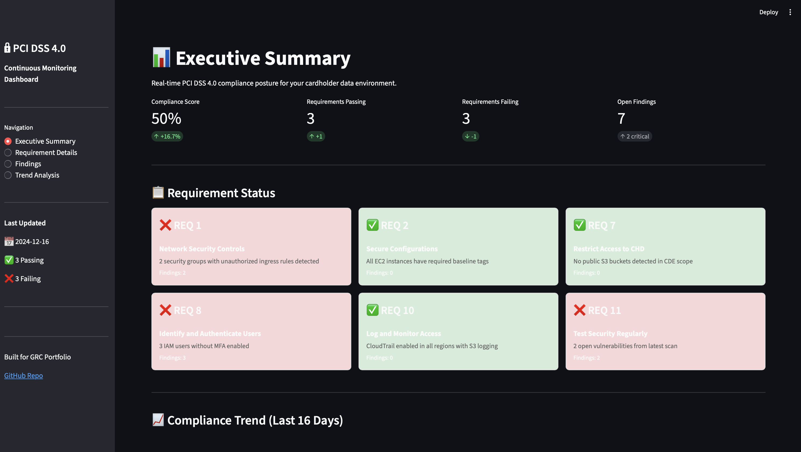
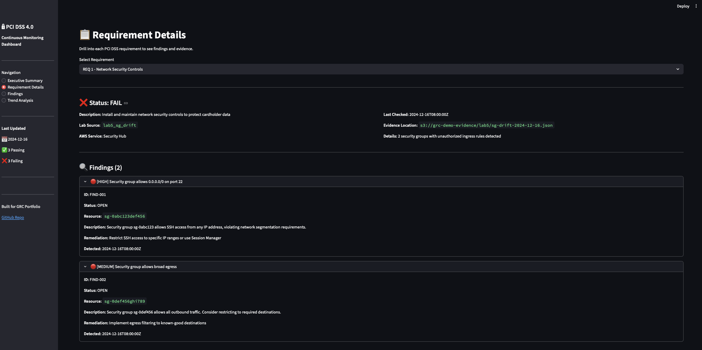
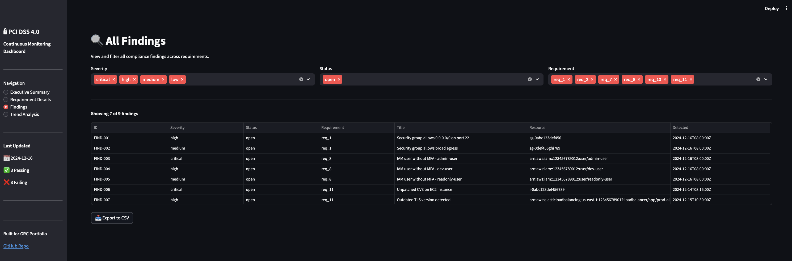
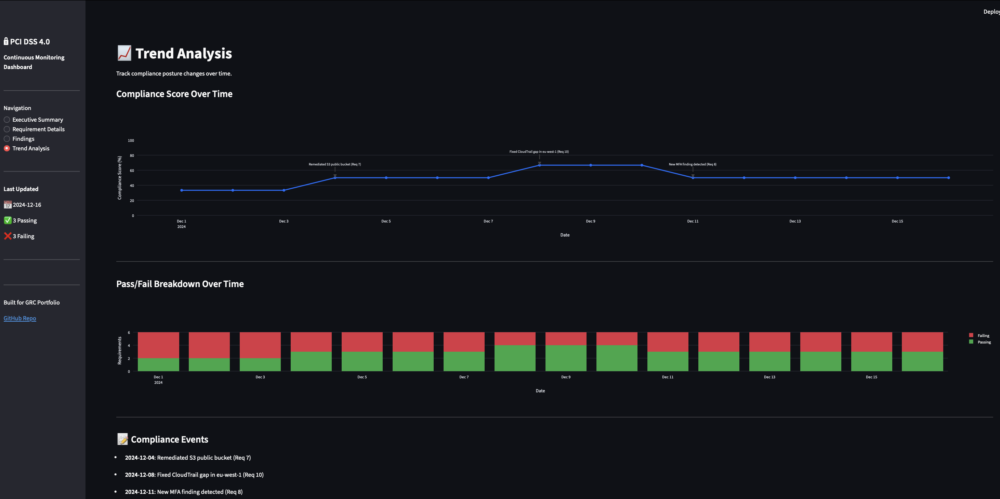

# PCI DSS Continuous Monitoring Dashboard

Real-time compliance dashboard for PCI DSS 4.0 requirements, built with Streamlit.

## Overview

This dashboard aggregates security telemetry from AWS compliance labs and displays:

- **Executive Summary** – Overall compliance score with pass/fail breakdown
- **Requirement Details** – Drill into each PCI requirement with findings and evidence links
- **Findings List** – Filterable view of all compliance findings with CSV export
- **Trend Analysis** – Compliance score changes over time with event annotations

## PCI DSS 4.0 Requirements Covered

| Requirement | Description | Data Source |
|-------------|-------------|-------------|
| Req 1 | Network Security Controls | Lab 5 – Security Group Drift |
| Req 2 | Secure Configurations | Lab 2 – EC2 Inventory |
| Req 7 | Restrict Access to CHD | Lab 3 – S3 Public-Access |
| Req 8 | Identify and Authenticate | Lab 4 – MFA Enforcement |
| Req 10 | Log and Monitor Access | Lab 1 – CloudTrail Validation |
| Req 11 | Test Security Regularly | Simulated Vulnerability Scan |

## Tech Stack

- **Dashboard**: Streamlit
- **Visualization**: Plotly
- **Data**: Pandas, YAML, JSON
- **AWS Integration**: boto3 (for live data, optional)

## Quick Start

```bash
# Create virtual environment
python3 -m venv .venv
source .venv/bin/activate

# Install dependencies
pip install -r requirements.txt

# Run the dashboard
streamlit run app/main.py
```

The dashboard will open at `http://localhost:8501`

## Project Structure

```
pci_compliance_dashboard/
├── README.md
├── requirements.txt
├── .gitignore
├── data/
│   ├── pci_requirements.yaml      # PCI DSS requirement definitions
│   ├── simulated_control_status.json  # Current control status
│   ├── simulated_findings.json    # All findings
│   ├── simulated_trend.json       # Historical trend data
│   └── simulated_vuln_scan.json   # Vulnerability scan results
├── app/
│   └── main.py                    # Streamlit application
├── etl/                           # (Future) Data pipeline scripts
├── db/                            # (Future) Database models
├── screenshots/                   # Dashboard screenshots
└── docs/                          # Documentation
```

## Demo Data

The dashboard uses simulated data that tells a compliance story:

1. **Day 1-3**: 33% compliance (2 passing, 4 failing)
2. **Day 4**: Remediated S3 public bucket → 50% compliance
3. **Day 8**: Fixed CloudTrail gap → 66% compliance
4. **Day 11**: New MFA finding detected → back to 50%

This demonstrates how continuous monitoring catches both improvements and regressions.

## Screenshots

### Executive Summary


### Requirement Details


### Findings


### Trend Analysis


## Future Enhancements

- [ ] Live AWS data integration (S3, Security Hub)
- [ ] Slack/email alerts for critical findings
- [ ] PDF report generation for auditors
- [ ] Multi-account support
- [ ] Jira integration for remediation tracking

## Author

Nelson Rosario – [Portfolio](https://nelsonrosariogrcportfolio.com)
